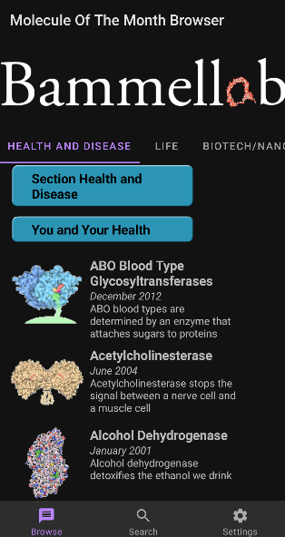
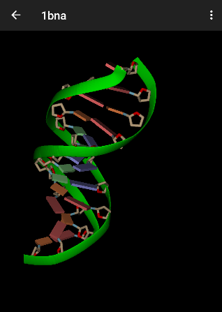

# [Molecule Of The Month Browser](https://github.com/jimandreas/MotmBrowser#molecule-of-the-month-browser)

This Android app presents information downloaded from RCSB.org - specifically it
supports browsing of the excellent Molecule of the Month (MotM) feature:

http://pdb101.rcsb.org/motm/motm-about

The MotmBrowser contains a 3D viewer for viewing the featured [RCSB Protein Data Bank] (PDB) molecules.
This viewer is under continuous development.

Screenshots:
------------




The MotmBrowser references the awesome work by the RCSB team.

from [https://pdb101.rcsb.org/more/how-to-cite]

```
Materials and images are free for use. Please cite PDB-101 (PDB101.rcsb.org).

* The reference for PDB-101 and RCSB PDB is:

The Protein Data Bank H.M. Berman, J. Westbrook, Z. Feng, G. Gilliland, T.N. Bhat,
H. Weissig, I.N. Shindyalov, P.E. Bourne (2000) Nucleic Acids Research, 28: 235-242.
doi:10.1093/nar/28.1.235

* The Molecule of the Month series can be referenced using:

The RCSB PDB "Molecule of the Month": Inspiring a Molecular View of Biology D.S. Goodsell,
S. Dutta, C. Zardecki, M. Voigt, H.M. Berman, S.K. Burley (2015) PLoS Biol 13(5): e1002140.
doi: 10.1371/journal.pbio.1002140

**Molecule of the Month illustrations are available under a CC-BY-4.0 license. Attribution should
be given to David S. Goodsell and the RCSB PDB. Molecule of the Month articles are copyrighted
by the RCSB PDB and the authors of the article. Text can only be reprinted with permission,
with attribution, and without the right to manipulate or change its content.
To request permission, please contact info@rcsb.org.**
```

Note: RCSB = Research Collaboratory for Structural Bioinformatics

Image credits:<br>

* [Launch icon] :  <br>
    [https://en.wikipedia.org/wiki/List_of_interstellar_and_circumstellar_molecules#/media/File:Trihydrogen-cation-3D-vdW.png]<br>
The H+ 3 cation is one of the most abundant ions in the universe. It was first detected in 1993.[71][72]

* The [MotM images] are derived from the pdp101 website and are used under the [CC-BY-4.0 license].

* The PDB molecule thumbnail images are self-generated and reside in the [KotmolMotmImages] repo on Github.

### Source credits

<b><i>The Motmbrowser user interface is leveraged from the following:</i></b><br>

Original CheeseSquare repo: [http://github.com/chrisbanes/cheesesquare]

Wikipedia search functionality: [https://github.com/wikimedia/apps-android-wikipedia]

OpenGL tutorials: [https://github.com/jimandreas/AndroidOpenGLESLessons]

Rajawali: Math functions leveraged from [Rajawali]

<b> License:</b> See the [LICENSE] file in the repository (Apache2.0)

[Launch icon]:http://commons.wikimedia.org/wiki/File:Trihydrogen-cation-3D-vdW.png
[LICENSE]:LICENSE

[MotM images]:https://pdb101.rcsb.org/motm/motm-image-download

[CC-BY-4.0 license]:https://creativecommons.org/licenses/by/4.0/

[RCSB Protein Data Bank]:http://www.rcsb.org/

[Rajawali]:https://github.com/Rajawali/Rajawali

[KotmolMotmImages]:https://github.com/kotmol/KotmolMotmImages

## Other apps:

* [Capture Images]

* [Standalone]

* [Screensaver]

[Capture Images]:README-captureimages.md
[Standalone]:README-standalone.md
[Screensaver]:README-screensaver.md

