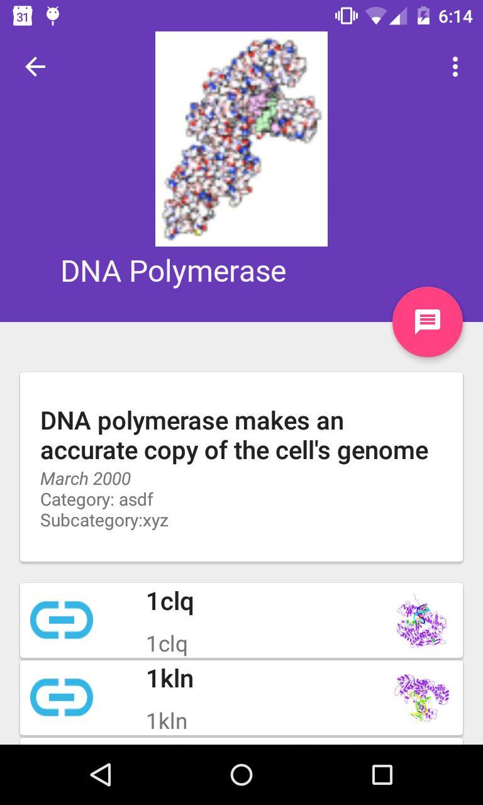

Molecule Of The Month Browser
=============================

This app presents information downloaded from RCSB.org - specifically it
supports browsing of the excellent Molecule of the Month feature:

http://pdb101.rcsb.org/motm/motm-about

Status:  <b> Converted to Kotlin. </b>

Screenshots:
------------

Image credits: 

* launch icon :  http://commons.wikimedia.org/wiki/File:Trihydrogen-cation-3D-vdW.png 
    http://en.wikipedia.org/wiki/List_of_interstellar_and_circumstellar_molecules 
The H+ 3 cation is one of the most abundant ions in the universe. It was first detected in 1993.[71][72]

* molecule PNG graphics 
All PNG graphics and categories of molecules are sourced from http://pdb101.rcsb.org/motm/motm-about

SOURCES
=======

<b><i>The User Interface is leveraged from the following:</i></b> 

<b>Original CheeseSquare repo: (http://github.com/chrisbanes/cheesesquare)</b>

<b> License:</b> See LICENSE file in repo (Apache2.0)

Copyright 2014 The Android Open Source Project, Inc.
Copyright 2016 Jim Andreas
